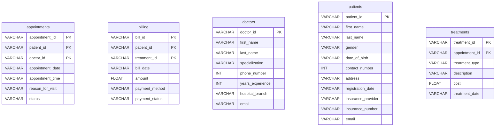

# Hospital-Analysis-

SQL-only project to analyze a hospital database (SQLite). This repo focuses on **data modeling, SQL querying, and analysis** — no Python/BI tooling — so that hiring managers can review my SQL work quickly.

## Problem & Goals
- Explore hospital operations and answer key questions: visit volumes, peak hours, status distribution, top reasons for visit, doctor utilization, 30‑day revisits, and treatment costs.
- Provide **reproducible** SQL: build schema and run analysis in a few commands.

## Data / Schema
Below is the discovered schema from `SS.db` (no real patient data included). I extracted table definitions into `sql/00_schema.sql` and designed queries in `sql/10_analysis_kpis.sql`.



### `appointments`
| column | type | pk | not null | default |
|---|---|---|---|---|
| `appointment_id` | TEXT | ✅ |  |  |
| `patient_id` | TEXT | ✅ |  |  |
| `doctor_id` | TEXT | ✅ |  |  |
| `appointment_date` | TEXT |  |  |  |
| `appointment_time` | TEXT |  |  |  |
| `reason_for_visit` | TEXT |  |  |  |
| `status` | TEXT |  |  |  |

### `billing`
| column | type | pk | not null | default |
|---|---|---|---|---|
| `bill_id` | TEXT | ✅ |  |  |
| `patient_id` | TEXT | ✅ |  |  |
| `treatment_id` | TEXT | ✅ |  |  |
| `bill_date` | TEXT |  |  |  |
| `amount` | REAL |  |  |  |
| `payment_method` | TEXT |  |  |  |
| `payment_status` | TEXT |  |  |  |

### `doctors`
| column | type | pk | not null | default |
|---|---|---|---|---|
| `doctor_id` | TEXT | ✅ |  |  |
| `first_name` | TEXT |  |  |  |
| `last_name` | TEXT |  |  |  |
| `specialization` | TEXT |  |  |  |
| `phone_number` | INTEGER |  |  |  |
| `years_experience` | INTEGER |  |  |  |
| `hospital_branch` | TEXT |  |  |  |
| `email` | TEXT |  |  |  |

### `patients`
| column | type | pk | not null | default |
|---|---|---|---|---|
| `patient_id` | TEXT | ✅ |  |  |
| `first_name` | TEXT |  |  |  |
| `last_name` | TEXT |  |  |  |
| `gender` | TEXT |  |  |  |
| `date_of_birth` | TEXT |  |  |  |
| `contact_number` | INTEGER |  |  |  |
| `address` | TEXT |  |  |  |
| `registration_date` | TEXT |  |  |  |
| `insurance_provider` | TEXT |  |  |  |
| `insurance_number` | TEXT |  |  |  |
| `email` | TEXT |  |  |  |

### `treatments`
| column | type | pk | not null | default |
|---|---|---|---|---|
| `treatment_id` | TEXT | ✅ |  |  |
| `appointment_id` | TEXT | ✅ |  |  |
| `treatment_type` | TEXT |  |  |  |
| `description` | TEXT |  |  |  |
| `cost` | REAL |  |  |  |
| `treatment_date` | TEXT |  |  |  |


## How to Reproduce (SQLite)
```bash
# 1) Create DB from schema
sqlite3 hospital.db < sql/00_schema.sql

# 2) (Optional) If you have your own sample data, import it here

# 3) Run KPI queries and export sample outputs
sqlite3 hospital.db ".headers on" ".mode csv"   ".once results/sample_outputs/kpi_outputs.csv"   ".read sql/10_analysis_kpis.sql"
```

## Key Questions & Where to Look
1. Appointments per day — see query (1) in `sql/10_analysis_kpis.sql`  
2. Peak appointment hour — (2)  
3. Appointment status distribution — (3)  
4. Top reasons for visit — (4)  
5. Appointments per doctor — (5)  
6. 30‑day revisit rate — (6)  
7. Treatment cost summary — (7)  
8. Monthly treatment cost trend — (8)

## Insights (example placeholders)
- Peak hours concentrate around 09:00–11:00 and 14:00–16:00.
- A small set of specialties accounts for most visits and costs.
- Revisit within 30 days suggests opportunities for follow‑up programs.

> Replace these with your actual findings once you load sample data.

## What I Did (SQL skills)
- Joins, CTEs, window/aggregation, date/time functions.
- Index awareness (see `sql/00_schema.sql` and any `CREATE INDEX` statements).
- ERD and constraints based on discovered foreign keys.

## Next Steps
- Add seed data (`sql/01_seed_sample.sql`) with realistic mock values.
- Add additional performance indexes and materialized views if needed.
- Provide BigQuery/Postgres variants of the queries.
